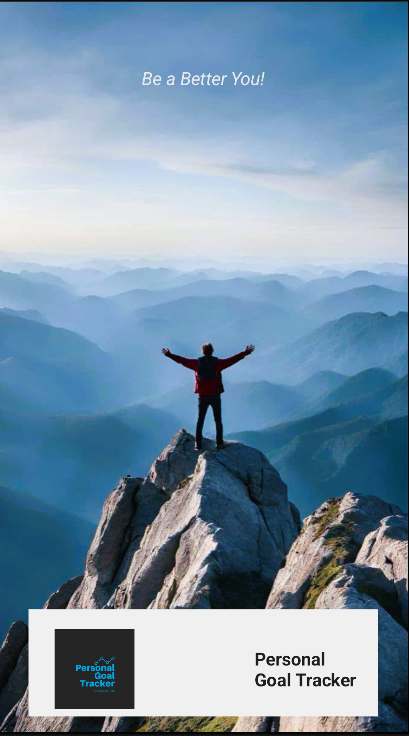
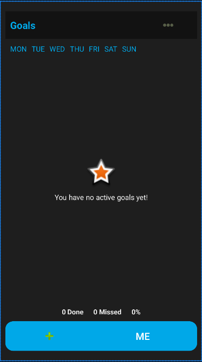
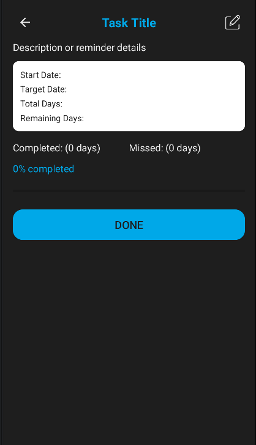

# goal-tracker-app
Personal Goal Tracker App A productivity-focused Android application that empowers users to set goals, track tasks, and stay accountable through smart reminders and visual progress indicators. Built with Java, XML, and SQLite, the app combines clean UI design with real-time functionality to support personal growth and habit-building.
# 🎯 Personal Goal Tracker App

A user-centered Android application designed to help individuals set goals, track tasks, and monitor progress in real time.

---

## 🚀 Features
- ✅ Smart reminders to keep users on track
- 📊 Visual progress indicators for motivation
- 🔄 Real-time task tracking
- 🔔 Push notifications for accountability
- 💾 Offline data persistence using SQLite
- 🎨 Clean and intuitive UI built with XML

---

## 🛠️ Tech Stack
- **Language**: Java  
- **UI**: XML  
- **Database**: SQLite  
- **IDE**: Android Studio  
- **Design Tools**: Figma  
- **APIs**: RESTful integration for future scalability

---

## 📸 Screenshots
- 
-   
-   
- 

---

## 👩‍💻 Developer
**Hina Atiq**  
Computer Science Undergraduate | Android Developer | Ethical Tech Enthusiast  
📧 hinaatiq350@gmail.com  
🔗 LinkedIn: https://linkedin.com/in/hina-atiq
💻 Portfolio: https://github.com/hinaatiq

---

## 📌 Future Improvements
- Cloud sync and user authentication  
- AI feature of Eisen-Hower matrix
